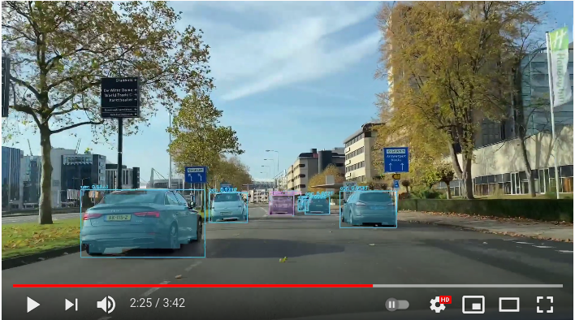
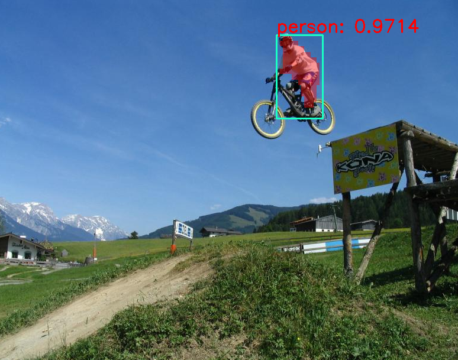

<h1>Object detection using a region based Convolutional Neural Network  (R-CNN)</h1>

<h2>Usage</h2>

<ul>
  <li>git clone https://github.com/jopverhagen/mask_r-cnn.git</li>
  <li>Download pretrained weights from: http://download.tensorflow.org/models/object_detection/mask_rcnn_inception_v2_coco_2018_01_28.tar.gz. (place frozen_inference_graph.pb in main folder)</li>

  <li>input.jpg: Your input image</li>
  <li> run: python run_rcnn.py</li>
  
 </ul>
